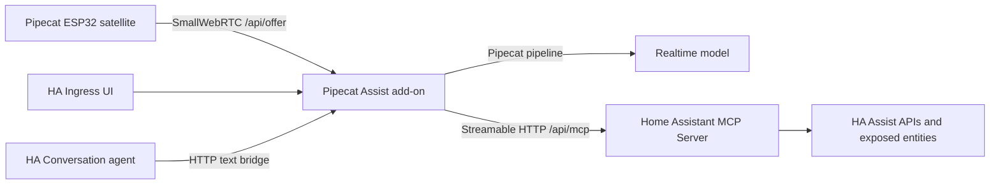

<p align="center">
  
</p>

# Pipecat Home Assistant

Pipecat Home Assistant is a Home Assistant app repository for a realtime,
multimodal assistant built on [Pipecat](https://github.com/pipecat-ai/pipecat).
The project replaces the synchronous Assist audio path with a Pipecat WebRTC
session while keeping Home Assistant device control through the native Home
Assistant MCP server.

## What is included

- `addons/pipecat_assist` - the Home Assistant app/add-on. It runs Pipecat,
  exposes a configuration UI through Ingress, serves `/api/offer` for
  Pipecat ESP32 SmallWebRTC clients, and connects to Home Assistant MCP.
- `addons/pipecat_assist/ui-src` - the React source for the pipeline editor
  shipped as static assets inside the add-on image.
- `custom_components/pipecat_assist` - a small Home Assistant conversation
  entity that forwards text requests into the add-on, so existing HA
  conversation entry points can select "Pipecat Realtime".
- `.github/workflows` - CI and GHCR publishing workflows for multi-arch Home
  Assistant images.

## Branding in Home Assistant

The repository ships Pipecat branding assets in the places Home Assistant reads:

- `addons/pipecat_assist/icon.png` and `addons/pipecat_assist/logo.png` for the
  Supervisor app/add-on listing.
- `custom_components/pipecat_assist/brand/icon.png` and
  `custom_components/pipecat_assist/brand/logo.png` for the custom integration
  dialog on Home Assistant 2026.3 and newer.
- `addons/pipecat_assist/app/ui/logo.svg` for the add-on Ingress UI.

The Ingress sidebar entry still uses `panel_icon: mdi:account-voice`, because
Home Assistant panel icons are configured as MDI icons.

## Architecture



## Quick start

1. Add this repository to Home Assistant as an app/add-on repository.
2. Install **Pipecat Assist**.
3. Enable Home Assistant's **Model Context Protocol Server** integration.
4. Start the add-on and open the web UI.
5. Open **Runtime > Home Assistant** and click **Check MCP**. In a normal
   Home Assistant add-on install, Pipecat Assist uses the Supervisor token
   automatically.
6. Configure model providers:
   OpenAI, Gemini, Anthropic, Bedrock, Azure/OpenAI-compatible endpoints,
   Ollama, or local runtimes.
7. Choose or create a pipeline, then configure its model, tools, audio, and
   satellite settings in the UI.
8. Build Pipecat ESP32 firmware with the generated
   `PIPECAT_SMALLWEBRTC_URL`.

For a complete Google Gemini Live setup and Home Assistant Assist test path,
see [Gemini Live in Home Assistant](docs/gemini-live-home-assistant.md).

Home Assistant MCP access uses the add-on's Supervisor token by default. Use
**Runtime > Home Assistant > Reset MCP** to clear custom MCP overrides and
return to the Supervisor-backed defaults. Manually pasted long-lived access
tokens are only needed for custom installations outside the Supervisor path.

## Audio debugging

Open **Runtime > Audio debug**, enable **Record audio in/out**, save, and then
run the browser voice test or connect a satellite. The add-on writes separate
WAV files for microphone input and assistant output under `/data/audio-debug`
and exposes download links in the Runtime panel. Use **Clear** after debugging,
because these files may contain private household audio.

## Pipecat ESP32

Pipecat ESP32 expects a SmallWebRTC offer endpoint:

```bash
export PIPECAT_SMALLWEBRTC_URL="http://<home-assistant-lan-ip>:7860/api/offer?token=<satellite-secret>"
```

This repository intentionally keeps the ESP32 firmware separate for now. The
next step is to integrate Pipecat ESP32 into ESPHome so the device side and the
Home Assistant add-on become one ecosystem.

## Development

The add-on source is in `addons/pipecat_assist`.

```bash
python -m compileall addons/pipecat_assist/app custom_components/pipecat_assist
```

For the React UI:

```bash
cd addons/pipecat_assist/ui-src
pnpm install
pnpm build
```

For a container build:

```bash
docker build -t pipecat-assist:dev addons/pipecat_assist
```

## References

- Pipecat: https://github.com/pipecat-ai/pipecat
- Pipecat Flows: https://github.com/pipecat-ai/pipecat-flows
- Pipecat Flows Editor: https://github.com/pipecat-ai/pipecat-flows-editor
- Pipecat logo source: https://github.com/pipecat-ai/voice-ui-kit/blob/main/package/src/components/elements/PipecatLogo.tsx
- Pipecat ESP32: https://github.com/pipecat-ai/pipecat-esp32
- Home Assistant MCP server: https://www.home-assistant.io/integrations/mcp_server/
- Home Assistant app docs: https://developers.home-assistant.io/docs/apps/configuration/
- Home Assistant app presentation assets: https://developers.home-assistant.io/docs/apps/presentation/
- Home Assistant local integration brand assets: https://developers.home-assistant.io/blog/2026/02/24/brands-proxy-api/
