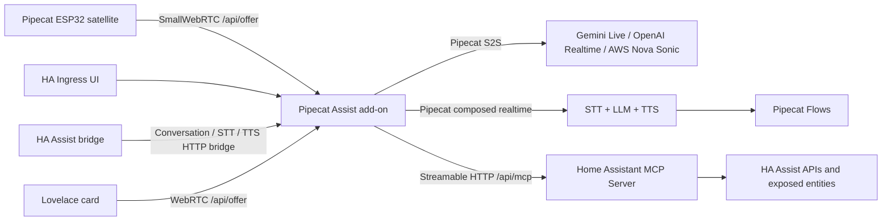

<p align="center">
  
</p>

# Pipecat Home Assistant

Pipecat Home Assistant is a Home Assistant app repository for a realtime,
multimodal assistant built on [Pipecat](https://github.com/pipecat-ai/pipecat).
The project replaces the synchronous Assist audio path with a Pipecat WebRTC
session while keeping Home Assistant device control through the native Home
Assistant MCP server.

## What is included

- `addons/pipecat_assist` - the Home Assistant app/add-on. It runs Pipecat,
  exposes a configuration UI through Ingress, serves `/api/offer` for
  Pipecat ESP32 SmallWebRTC clients, and connects to Home Assistant MCP.
- `addons/pipecat_assist/ui-src` - the React source for the pipeline editor
  shipped as static assets inside the add-on image.
- `custom_components/pipecat_assist` - a Home Assistant integration that
  exposes Pipecat Assist as Conversation, STT, and TTS entities, plus a
  Lovelace WebRTC card asset.
- `.github/workflows` - CI and GHCR publishing workflows for multi-arch Home
  Assistant images.

## Architecture



## Quick start

1. Add this repository to Home Assistant as an app/add-on repository.
2. Install **Pipecat Assist**.
3. Enable Home Assistant's **Model Context Protocol Server** integration.
4. Start the add-on and open the web UI.
5. Open **Integrations > Home Assistant MCP** and click **Test MCP**. In a normal
   Home Assistant add-on install, Pipecat Assist uses the Supervisor token
   automatically.
6. Configure model providers:
   Gemini Live is the default, and additional providers such as OpenAI,
   Soniox, Deepgram, Cartesia, Gradium, Speechmatics, AWS, ElevenLabs, Google
   Cloud TTS HTTP fallback/Streaming, OpenAI-compatible endpoints, Ollama, local
   runtimes, and Web Search can be added from **Integrations**.
7. Choose or create a pipeline. The built-in catalog includes realtime
   speech-to-speech profiles and composed realtime profiles such as
   `Soniox + OpenAI + Cartesia`, `Deepgram + Gemini + Google TTS`, and
   `Speechmatics + AWS Nova Pro + ElevenLabs`.
8. Build Pipecat ESP32 firmware with the generated
   `PIPECAT_SMALLWEBRTC_URL`.

Home Assistant MCP access uses the add-on's Supervisor token by default. Use
**Integrations > Home Assistant MCP > Automatic defaults** to clear custom MCP
overrides and return to the Supervisor-backed defaults. Manually pasted
long-lived access tokens are only needed for custom installations outside the
Supervisor path.

Gemini Live is the default first-run pipeline. Add a Google AI Studio key in
**Integrations > Google Gemini Live**, keep
`models/gemini-3.1-flash-live-preview` as the realtime model, and use
**Assistant > Start voice test** to verify the browser voice path. The Home
Assistant Assist bridge is best-effort compatibility with the classic HA
Assist path; configure a composed pipeline for STT/TTS, install
`custom_components/pipecat_assist`, add the **Pipecat Assist** integration, and
select **Pipecat Assist** for Conversation, Speech-to-text, and Text-to-speech.

## Pipelines and Pipecat Flows

Pipecat Assist supports two realtime runtime families:

- **Speech-to-speech realtime**: Gemini Live, OpenAI Realtime, and AWS Nova
  Sonic take audio in and return audio directly. These are the lowest-friction
  profiles and Gemini Live remains the first-run default.
- **Composed realtime**: streaming STT, streaming LLM, and streaming TTS are
  chained by Pipecat. These pipelines are still realtime over WebRTC, but each
  stage can use a different provider. Compatible TTS providers can synthesize
  streamed LLM output in sentence or token chunks.

Provider integrations are intentionally split by capability. OpenAI Realtime
and Gemini Live are speech-to-speech providers; OpenAI Cloud and Google Gemini
Cloud are composed/text providers. Session Memory and Web Search are separate
pipeline steps. Web Search selects a cloud LLM provider such as OpenAI Cloud or
Google Gemini Cloud, while Home Assistant device control remains on MCP.

Official `pipecat-ai-flows` support is enabled for composed realtime pipelines.
The flow editor stores nodes, transition functions, JSON schemas, and optional
Home Assistant MCP tool calls. For speech-to-speech services, the UI disables
the Pipecat Flow tile because Pipecat Flows does not currently support Gemini
Live or OpenAI Realtime S2S APIs.

## Home Assistant Assist and Lovelace

The custom component exposes Pipecat Assist in all three Home Assistant Assist
slots: Conversation, Speech-to-text, and Text-to-speech. Select the single
`pipecat-assist` language entry; the actual spoken language and voice remain
configured in the add-on pipeline and provider integrations. The HA Assist
bridge is not full-duplex like the Pipecat WebRTC path, but it lets standard HA
Assist entry points call the active Pipecat pipeline where the provider supports
the requested bridge operation.

The Lovelace card is served by the integration at
`/pipecat_assist/pipecat-assist-card.js`, is loaded automatically by the custom
component, and uses the same WebRTC assistant path as the add-on demo.

## Audio debugging

Open **Runtime**, enable **Record audio in/out**, save, and then
run the browser voice test or connect a satellite. The add-on writes separate
WAV files for microphone input and assistant output under `/data/audio-debug`
and exposes download links in the Runtime panel. Use **Clear** after debugging,
because these files may contain private household audio.

## Pipecat ESP32

Pipecat ESP32 expects a SmallWebRTC offer endpoint:

```bash
export PIPECAT_SMALLWEBRTC_URL="http://<home-assistant-lan-ip>:7860/api/offer?token=<satellite-secret>"
```

This repository intentionally keeps the ESP32 firmware separate for now. The
next step is to integrate Pipecat ESP32 into ESPHome so the device side and the
Home Assistant add-on become one ecosystem. The direct ESP32 authentication
path will move toward the standard Home Assistant token flow during that work.

## Development

The add-on source is in `addons/pipecat_assist`.

```bash
python -m compileall addons/pipecat_assist/app custom_components/pipecat_assist
```

For the React UI:

```bash
cd addons/pipecat_assist/ui-src
pnpm install
pnpm build
```

For a container build:

```bash
docker build -t pipecat-assist:dev addons/pipecat_assist
```

## References

- Pipecat: https://github.com/pipecat-ai/pipecat
- Pipecat Flows: https://github.com/pipecat-ai/pipecat-flows
- Pipecat Flows Editor: https://github.com/pipecat-ai/pipecat-flows-editor
- Pipecat ESP32: https://github.com/pipecat-ai/pipecat-esp32
- Home Assistant MCP server: https://www.home-assistant.io/integrations/mcp_server/
- Home Assistant app docs: https://developers.home-assistant.io/docs/apps/configuration/
