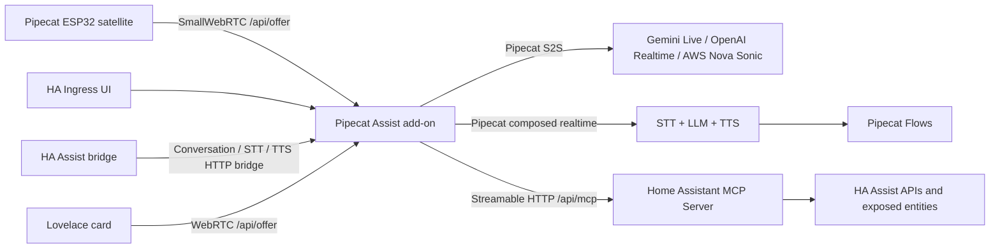

<p align="center">
  
</p>

# Pipecat Home Assistant

<p align="center">
  <a href="https://github.com/kyvaith/pipecat-homeassistant/actions/workflows/ci.yml">
    
  </a>
  <a href="https://github.com/kyvaith/pipecat-homeassistant/actions/workflows/publish.yml">
    
  </a>
  <a href="https://github.com/kyvaith/pipecat-homeassistant/releases">
    
  </a>
  <a href="LICENSE">
    
  </a>
  <a href="https://www.home-assistant.io/">
    
  </a>
  <a href="https://github.com/pipecat-ai/pipecat">
    
  </a>
</p>

Pipecat Assist brings realtime, multimodal Pipecat assistants to Home
Assistant. It lets you talk to speech-to-speech realtime models, build custom
Pipecat pipelines from cloud and local AI services, and keep Home Assistant
device control through MCP.

## What Pipecat Assist offers

- **Realtime voice assistants** over WebRTC, with Gemini Live as the default
  first-run speech-to-speech pipeline.
- **Custom pipeline builder** for speech-to-speech and composed realtime flows:
  mix STT, LLM, TTS, memory, web search, Home Assistant tools, and Pipecat
  Flows in one runtime profile.
- **Cloud provider integrations** for Gemini, OpenAI, Soniox, Deepgram,
  Speechmatics, Cartesia, Gradium, ElevenLabs, Google Cloud TTS, AWS Bedrock,
  AWS Nova Sonic, and OpenAI-compatible endpoints.
- **Local AI options** through Ollama, local runtime endpoints, and custom
  OpenAI-compatible services.
- **Multiple MCP servers**, including the built-in Home Assistant MCP server,
  the Home Assistant MCP add-on, and additional custom MCP endpoints.
- **Visual Pipecat Flow editing** for composed realtime pipelines, including
  conditional conversation graphs and MCP-backed tool calls.
- **Audio debugging, session memory, and web search** as first-class runtime
  features rather than hidden provider toggles.

## Where you can use it

- **Pipecat Assist add-on UI**: a full-width assistant card for quick browser
  testing and pipeline development.
- **Lovelace dashboard card**: a dedicated WebRTC card with live transcript,
  smooth scrolling, and the most responsive full-duplex conversation path.
- **Home Assistant Assist**: the custom component exposes Pipecat Assist as
  Conversation, Speech-to-text, and Text-to-speech.
- **Home Assistant AI Tasks / AI Actions**: Pipecat Assist can be selected for
  generated-data tasks where your Home Assistant version exposes AI Task
  entities.
- **Pipecat ESP32 satellites**: the add-on exposes a SmallWebRTC endpoint for
  satellite clients.

The Home Assistant Assist path uses an advanced Pipecat Live Bridge so HA
Assist can talk to speech-to-speech realtime assistants such as Gemini Live and
OpenAI Realtime. Because HA Assist itself is still not a full-duplex WebRTC
client, this bridge cannot provide true barge-in while the assistant is
speaking. The Lovelace card and add-on assistant card remain the more
responsive realtime experience.

## Installation

1. Add this repository URL to Home Assistant **Settings > Add-ons > Add-on
   Store > Repositories**:

   ```text
   https://github.com/kyvaith/pipecat-homeassistant
   ```

2. Add the same repository URL to **HACS > Custom repositories** as an
   **Integration**.

3. Install the **Pipecat Assist** add-on/app from the Home Assistant add-on
   store.

4. Install the **Pipecat Assist** custom component from HACS, then restart Home
   Assistant when HACS asks you to.

5. Add the Pipecat Assist integration in **Settings > Devices & services**. The
   integration should auto-detect the add-on URL; keep the detected value unless
   you run the add-on in a custom network layout.

6. In **Settings > Voice assistants**, select **Pipecat Assist** in all three
   categories:

   - Conversation agent / LLM
   - Speech-to-text
   - Text-to-speech

   Use the single Pipecat Assist language entry. The actual voice, language,
   and provider settings are configured inside the add-on pipeline.

7. Optional: where your Home Assistant version exposes **AI Tasks** or **AI
   Actions**, select **Pipecat Assist** for LLM task handling and generated
   data. If your HA build exposes image-generation provider slots, configure
   them there according to the capabilities of your selected pipeline/provider.

8. Open the Pipecat Assist add-on UI and configure a provider:

   - Easiest start: create a Google AI Studio API key and paste it into
     **Integrations > Google Gemini Live**.
   - Advanced setup: create or edit a custom pipeline with your preferred cloud
     providers, local AI endpoints, and MCP servers.

9. Add the **Pipecat Assist** Lovelace card to a dashboard and start talking.

## Screenshots


## Repository layout

- `addons/pipecat_assist` - the Home Assistant app/add-on. It runs Pipecat,
  exposes a configuration UI through Ingress, serves `/api/offer` for
  Pipecat ESP32 SmallWebRTC clients, and connects to Home Assistant MCP.
- `addons/pipecat_assist/ui-src` - the React source for the pipeline editor
  shipped as static assets inside the add-on image.
- `custom_components/pipecat_assist` - a Home Assistant integration that
  exposes Pipecat Assist as Conversation, STT, TTS, AI Task entities, and the
  Lovelace WebRTC card asset.
- `.github/workflows` - CI and GHCR publishing workflows for multi-arch Home
  Assistant images.

## Architecture



## Quick start after installation

1. Start the add-on and open the web UI.
2. Open **Integrations > Home Assistant MCP** and click **Test MCP**. In a
   normal Home Assistant add-on install, Pipecat Assist uses the Supervisor
   token automatically.
3. Configure model providers. Gemini Live is the default, and additional
   providers such as OpenAI, Soniox, Deepgram, Cartesia, Gradium, Speechmatics,
   AWS, ElevenLabs, Google Cloud TTS HTTP fallback/Streaming,
   OpenAI-compatible endpoints, Ollama, local runtimes, and Web Search can be
   added from **Integrations**.
4. Choose or create a pipeline. The built-in catalog includes realtime
   speech-to-speech profiles and composed realtime profiles such as
   `Soniox + OpenAI + Cartesia`, `Deepgram + Gemini + Google TTS`, and
   `Speechmatics + AWS Nova Pro + ElevenLabs`.
5. Build Pipecat ESP32 firmware with the generated
   `PIPECAT_SMALLWEBRTC_URL`.

Home Assistant MCP access uses the add-on's Supervisor token by default. Use
**Integrations > Home Assistant MCP > Automatic defaults** to clear custom MCP
overrides and return to the Supervisor-backed defaults. Manually pasted
long-lived access tokens are only needed for custom installations outside the
Supervisor path.

Gemini Live is the default first-run pipeline. Add a Google AI Studio key in
**Integrations > Google Gemini Live**, keep
`models/gemini-3.1-flash-live-preview` as the realtime model, and use
**Assistant > Start voice test** to verify the browser voice path. The Home
Assistant Assist bridge is best-effort compatibility with the classic HA
Assist path; configure a composed pipeline for STT/TTS, install
`custom_components/pipecat_assist`, add the **Pipecat Assist** integration, and
select **Pipecat Assist** for Conversation, Speech-to-text, and Text-to-speech.

## Pipelines and Pipecat Flows

Pipecat Assist supports two realtime runtime families:

- **Speech-to-speech realtime**: Gemini Live, OpenAI Realtime, and AWS Nova
  Sonic take audio in and return audio directly. These are the lowest-friction
  profiles and Gemini Live remains the first-run default.
- **Composed realtime**: streaming STT, streaming LLM, and streaming TTS are
  chained by Pipecat. These pipelines are still realtime over WebRTC, but each
  stage can use a different provider. Compatible TTS providers can synthesize
  streamed LLM output in sentence or token chunks.

Provider integrations are intentionally split by capability. OpenAI Realtime
and Gemini Live are speech-to-speech providers; OpenAI Cloud and Google Gemini
Cloud are composed/text providers. Session Memory and Web Search are separate
pipeline steps. Web Search selects a cloud LLM provider such as OpenAI Cloud or
Google Gemini Cloud, while Home Assistant device control remains on MCP.

Official `pipecat-ai-flows` support is enabled for composed realtime pipelines.
The flow editor stores nodes, transition functions, JSON schemas, and optional
Home Assistant MCP tool calls. For speech-to-speech services, the UI disables
the Pipecat Flow tile because Pipecat Flows does not currently support Gemini
Live or OpenAI Realtime S2S APIs.

## Home Assistant Assist and Lovelace

The custom component exposes Pipecat Assist in all three Home Assistant Assist
slots: Conversation, Speech-to-text, and Text-to-speech. Select the single
`pipecat-assist` language entry; the actual spoken language and voice remain
configured in the add-on pipeline and provider integrations. The HA Assist
bridge is not full-duplex like the Pipecat WebRTC path, but it lets standard HA
Assist entry points call the active Pipecat pipeline where the provider supports
the requested bridge operation.

The Lovelace card is served by the integration at
`/pipecat_assist/pipecat-assist-card.js`, is loaded automatically by the custom
component, and uses the same WebRTC assistant path as the add-on demo. It calls
the custom component proxy by default, so dashboard YAML does not need an
Ingress token or flow ID.

Useful card options:

```yaml
type: custom:pipecat-assist-card
name: Pipecat Assist
animation_on_idle: true
compact_mode: false
accent_color: "#206cff"
audio_buffer_ms: 120
```

`compact_mode` hides the transcript. `audio_buffer_ms` hints the browser WebRTC
jitter buffer; higher values can smooth playback with a small latency tradeoff.

## Audio debugging

Open **Runtime**, enable **Record audio in/out**, save, and then
run the browser voice test or connect a satellite. The add-on writes separate
WAV files for microphone input and assistant output under `/data/audio-debug`
and exposes download links in the Runtime panel. Use **Clear** after debugging,
because these files may contain private household audio.

## Pipecat ESP32

Pipecat ESP32 expects a SmallWebRTC offer endpoint:

```bash
export PIPECAT_SMALLWEBRTC_URL="http://<home-assistant-lan-ip>:7860/api/offer?token=<satellite-secret>"
```

This repository intentionally keeps the ESP32 firmware separate for now. The
next step is to integrate Pipecat ESP32 into ESPHome so the device side and the
Home Assistant add-on become one ecosystem. The direct ESP32 authentication
path will move toward the standard Home Assistant token flow during that work.

## Development

The add-on source is in `addons/pipecat_assist`.

```bash
python -m compileall addons/pipecat_assist/app custom_components/pipecat_assist
```

For the React UI:

```bash
cd addons/pipecat_assist/ui-src
pnpm install
pnpm build
```

For a container build:

```bash
docker build -t pipecat-assist:dev addons/pipecat_assist
```

## References

- Pipecat: https://github.com/pipecat-ai/pipecat
- Pipecat Flows: https://github.com/pipecat-ai/pipecat-flows
- Pipecat Flows Editor: https://github.com/pipecat-ai/pipecat-flows-editor
- Pipecat ESP32: https://github.com/pipecat-ai/pipecat-esp32
- Home Assistant MCP server: https://www.home-assistant.io/integrations/mcp_server/
- Home Assistant app docs: https://developers.home-assistant.io/docs/apps/configuration/
