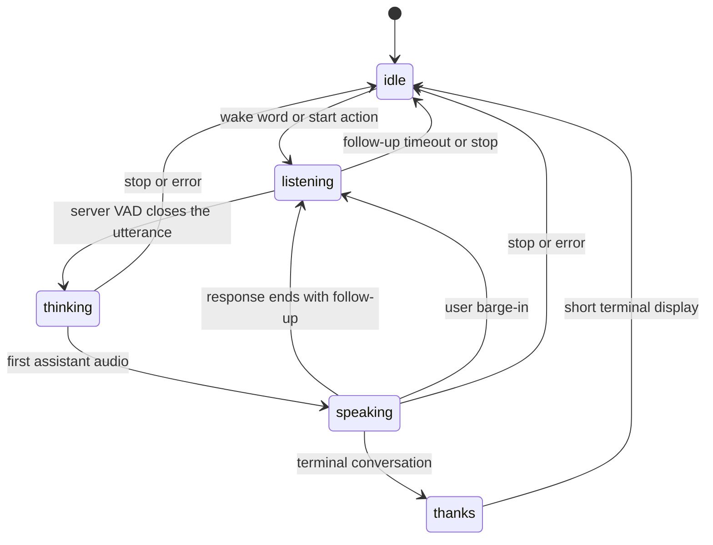

# ESPHome `va_pipecat`

`va_pipecat` connects an ESPHome voice satellite directly to Pipecat Assist.
It is intended for ESP32 devices using ESP-IDF, PSRAM, a 16 kHz mono
microphone source, and an ESPHome `speaker`.

The component uses a versioned WebSocket protocol:

- microphone uplink: PCM signed 16-bit little-endian, mono, 16 kHz;
- assistant downlink: PCM signed 16-bit little-endian, mono, 24 kHz;
- control and status: compact JSON;
- transcript text: UTF-8 encoded as Base64 inside JSON;
- server-driven phases: `idle`, `listening`, `thinking`, `speaking`, and
  `thanks`;
- full-duplex barge-in when the configured microphone source includes suitable
  echo control.

This is not a port of `pipecat-esp32`. That project owns the complete audio and
WebRTC stack for selected boards. `va_pipecat` instead composes with ESPHome's
microphone, speaker, wake-word, automations, and device UI.

## Configuration

Copy the complete **ESPHome satellite** URL from the Pipecat Assist
**Runtime** page. The URL contains a secret and should be stored in
`secrets.yaml`.

```yaml
external_components:
  - source: github://kyvaith/pipecat-homeassistant@dev
    components:
      - va_pipecat

psram:

va_pipecat:
  id: pipecat_va
  url: !secret pipecat_satellite_url
  microphone:
    microphone: processed_microphone
    channels: 0
  speaker: assistant_speaker
  barge_in: true
  playback_buffer_size: 2MB

  on_phase:
    - logger.log:
        format: "Pipecat phase: %s"
        args: [phase.c_str()]

  on_transcript:
    - logger.log:
        format: "%s: %s"
        args: [role.c_str(), text.c_str()]

  on_error:
    - logger.log:
        level: ERROR
        format: "Pipecat error %s: %s"
        args: [code.c_str(), message.c_str()]

micro_wake_word:
  # Configure models and the microphone as usual.
  on_wake_word_detected:
    - va_pipecat.start: pipecat_va

button:
  - platform: template
    name: Stop Pipecat conversation
    on_press:
      - va_pipecat.stop: pipecat_va
```

### Options

- **`url`** (required): authenticated `ws://` endpoint copied from Pipecat
  Assist. It can be changed at runtime with `va_pipecat.set_url`.
- **`microphone`** (required): one 16-bit mono ESPHome microphone source. The
  source is validated at 16 kHz.
- **`speaker`** (required): ESPHome speaker that accepts mono PCM16 playback.
- **`barge_in`** (optional, default `true`): keep microphone audio flowing
  while the assistant speaks. Enable this only when the selected microphone
  path suppresses playback echo well enough for server VAD.
- **`playback_buffer_size`** (optional, default `2MB`): PSRAM jitter buffer for
  assistant audio. Valid range: 64 kB to 4 MB.
- **`on_phase`**: receives the canonical phase string.
- **`on_transcript`**: receives `role` (`user` or `assistant`) and `text`.
- **`on_error`**: receives a stable error `code` and a human-readable
  `message`.
- **`on_repeated_failure`**: fires after repeated WebSocket reconnect failures.
- **`on_followup_opened`**: compatibility hook for a device-managed follow-up
  chime. Normal Pipecat follow-up turns do not require it.

### Actions and condition

- `va_pipecat.start`: open a new wake-word turn.
- `va_pipecat.interrupt`: cancel current assistant output and keep the
  conversation available for barge-in.
- `va_pipecat.stop`: end the local conversation and return to `idle`.
- `va_pipecat.set_url`: replace the endpoint and reconnect.
- `va_pipecat.set_volume`: set the assistant PCM output multiplier from 0 to
  100%.
- `va_pipecat.connected`: true while the WebSocket is connected.

## Conversation lifecycle



The server phase is authoritative, but `speaking` remains visible until the
device's PSRAM and downstream speaker buffers have actually drained. This
prevents music resume or UI teardown while the final audio is still audible.

