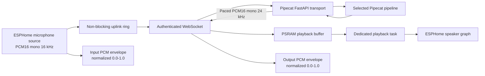

# ESPHome satellite architecture

Pipecat Assist supports ESPHome satellites through an authenticated,
versioned raw-PCM WebSocket transport at:

```text
ws://<home-assistant-lan-host>:7860/api/assist/esphome
```

The complete URL includes the active pipeline and satellite secret. A manual
copy is available in **Runtime > ESPHome satellite**, but normal add-on
installations provision it automatically through Home Assistant's native API.

## Why a dedicated ESPHome transport

The official `pipecat-esp32` project is useful reference code for
SmallWebRTC, Opus, and selected ESP-IDF boards, but it owns the board audio
stack. An ESPHome component must instead coexist with configured microphones,
speaker graphs, wake-word engines, AEC, UI automations, media playback, and
ESPHome lifecycle management.

For a LAN satellite, raw PCM also avoids Opus encode/decode and WebRTC state on
the microcontroller. Pipecat continues to own model transports and response
pacing on the Home Assistant host.

## Data plane



- The microphone callback only copies samples into a bounded staging ring. A
  separate task performs WebSocket writes, so Wi-Fi locks cannot block capture.
- Pipecat packetizes output into 40 ms frames and paces it in realtime.
- The device uses a configurable PSRAM jitter buffer and drains it outside the
  ESPHome main loop, isolating audio from display or artwork stalls.
- Interrupt frames flush queued assistant PCM before the next user utterance.
- Input and output envelopes are sampled without allocation and published to
  ESPHome automations at up to 30 Hz. This gives device UIs speech-reactive
  motion without coupling their renderer to an audio callback or duplicating
  PCM buffers.

## Control plane

Text WebSocket messages are compact JSON. Protocol version 1 defines:

| Direction | Type | Purpose |
| --- | --- | --- |
| server to device | `hello` | Protocol, PCM format, capabilities, and timing |
| device to server | `wake` | Begin a new wake-word turn |
| device to server | `interrupt` | Barge in and cancel current output |
| device to server | `stop` | End the conversation |
| device to server | `flush` | Drop incomplete microphone input |
| server to device | `phase` | Canonical UI state |
| server to device | `transcript` | Live user or assistant text |
| server to device | `interrupt` | Flush locally queued assistant PCM |
| server to device | `error` | Stable error code and safe display message |

The component accepts `replying` as a compatibility alias but emits
`speaking`.

## State ownership

Pipecat owns semantic conversation state. The device owns physical playback
completion:

1. Wake word opens `listening` immediately.
2. Server VAD moves the turn to `thinking`.
3. First bot speech moves it to `speaking`.
4. A server follow-up transition is held locally until the final PCM and
   downstream speaker buffers drain.
5. Barge-in flushes the playback queue and returns immediately to `listening`.
6. A terminal response shows `thanks` briefly and then returns to `idle`.

This division keeps the interface synchronized with what the user can actually
hear while avoiding device-side guesses about model or tool progress.

## Security and provisioning

- The endpoint is host-network `ws://` by default. Use it only on a trusted LAN
  or behind a TLS reverse proxy that terminates `wss://`.
- With `auto_provision: true`, `va_pipecat` registers a hidden
  `provision_pipecat(endpoint)` action. The add-on discovers namespaced ESPHome
  actions through the Home Assistant Core API and invokes each one every 15
  seconds. Repeating an unchanged endpoint is a no-op on the device and makes
  device reconnects self-healing.
- The add-on resolves its host from the configured runner host override,
  Home Assistant `internal_url`, `external_url`, then
  `homeassistant.local`. The runner's actual port is always used.
- The query token is a secret. It is transported as transient action data and
  is not published in an entity, provisioning status, or log message. For a
  non-Supervisor installation, store the manual fallback URL in ESPHome
  `secrets.yaml`.
- The active pipeline may be selected in the URL. Invalid pipeline IDs or
  tokens are rejected before a Pipecat worker starts.
